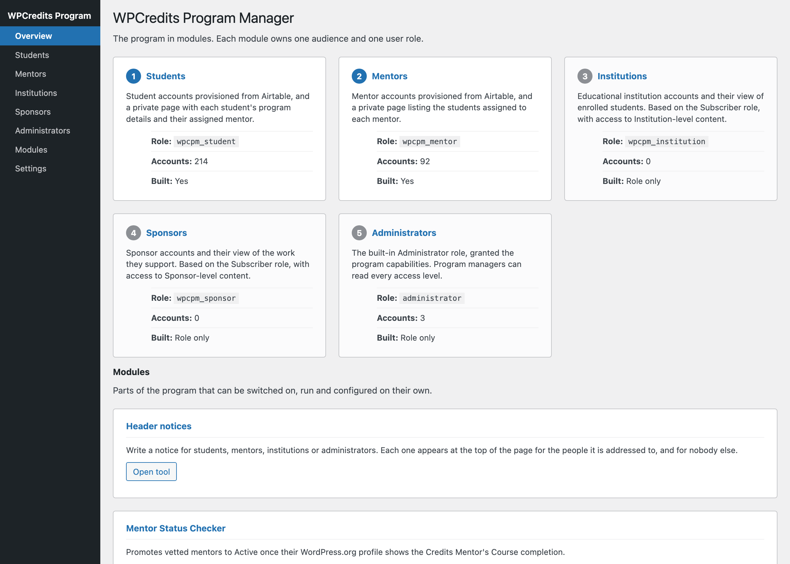
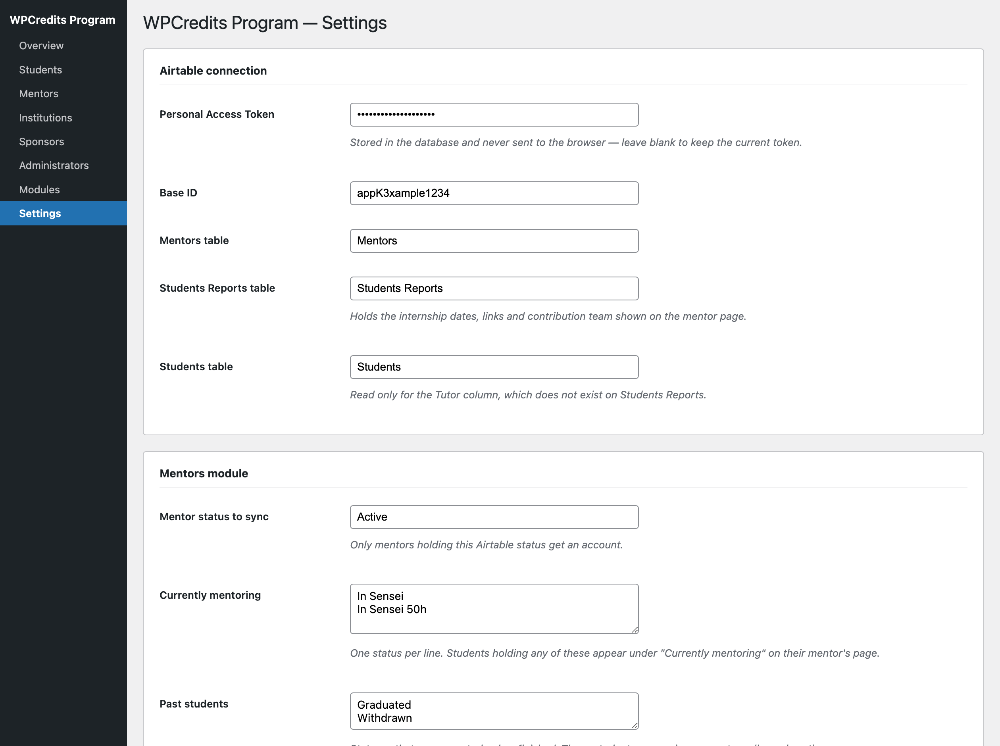
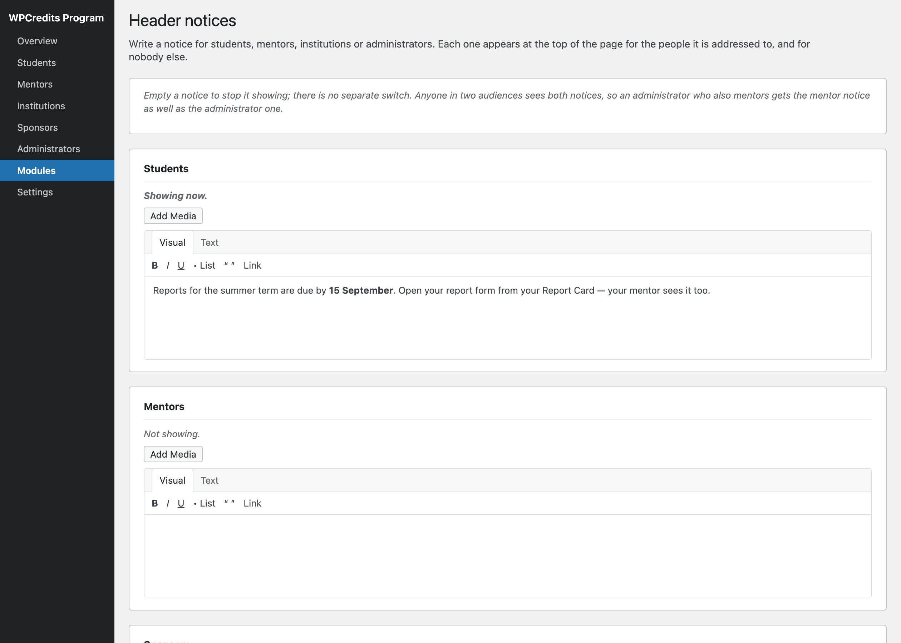
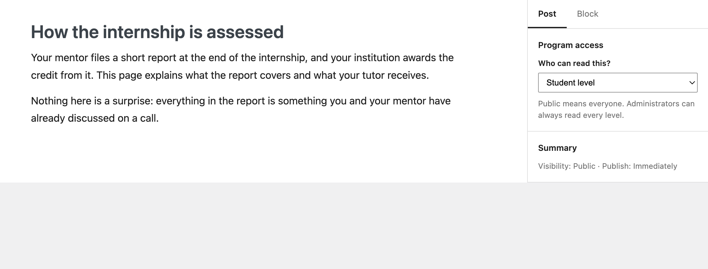
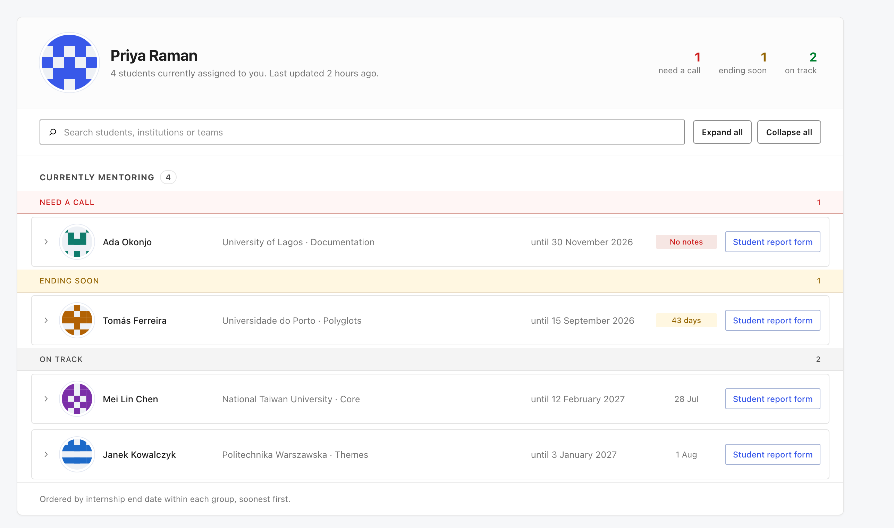
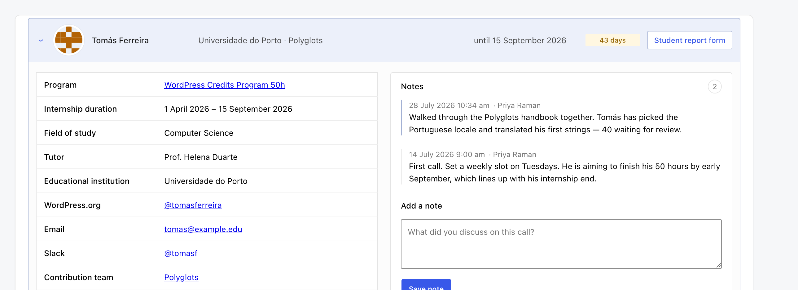
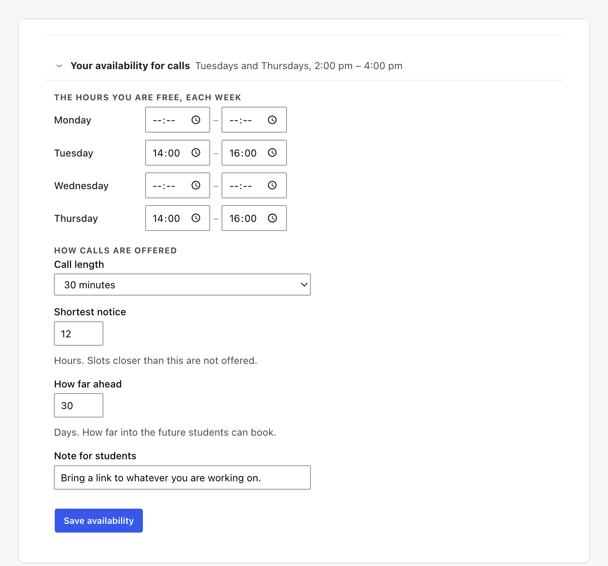
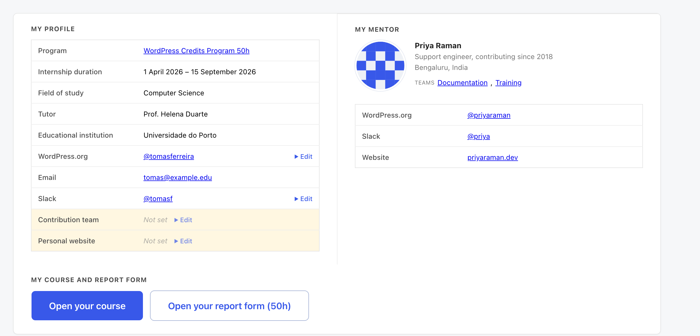
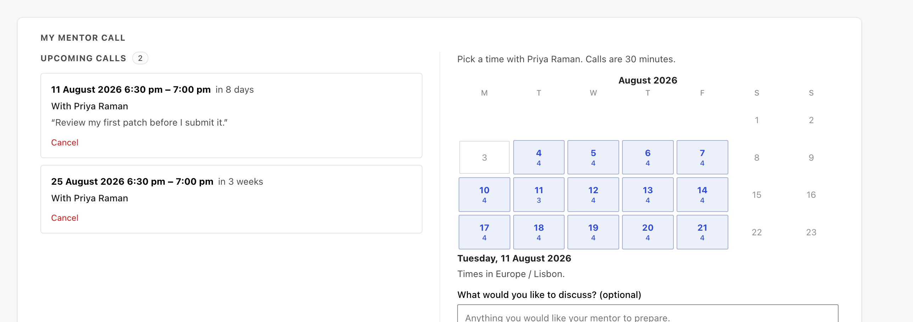

# Program manager guide

*The plugin in wp-admin — settings, modules, access levels and the sync — plus everything mentors and students are told.*

This guide covers running the program: the plugin's own screens in wp-admin, what every setting does, who can read what, and what to check when something looks wrong.

It also contains the mentor and student guides in full. Program managers are the people other people ask, and the access levels mean you cannot open either of those pages yourself.

## The plugin in wp-admin

Everything the program manager touches lives under one top-level menu, **WPCredits Program**. You
need the `wpcpm_manage_program` capability to see it, which the Administrator role is granted on
activation.

*The Overview screen. Each audience is a module with its own role, account count and screen.*

### Overview

One card per module, in menu order, each showing its role slug, how many accounts hold that role,
and whether the module is built or is currently role-only. Underneath, the same treatment for the
parts of the program that can be run on their own.

If Airtable is not connected yet, this screen says so and links straight to the setting.

### The module screens

| Screen | What it does |
| --- | --- |
| **Students** | The student list, the sync report, and one-at-a-time invitations. |
| **Mentors** | The mentor list, the sync report, and one-at-a-time invitations. |
| **Institutions** | Role only — registers `wpcpm_institution` and reserves the screen. |
| **Sponsors** | Role only — registers `wpcpm_sponsor` and reserves the screen. |
| **Administrators** | Lists the program capabilities granted to Administrator, and who holds the role. |

A role-only screen tells you the role slug, whether it is registered, and how many accounts hold it.
That is deliberate: the role exists and can gate content from the day it is added, long before the
module has screens of its own.

### Modules

The **Modules** submenu lists the parts of the program that are run and configured on their own
rather than belonging to one audience — currently **Header notices**, **Need help?** and the **Mentor
Status Checker**. Each has its own screen behind an *Open tool* button.

## Settings

**WPCredits Program → Settings**. One screen, in sections.

*The Airtable connection and the Mentors module, at the top of the settings screen.*

### Airtable connection

| Setting | What it is for |
| --- | --- |
| **Personal Access Token** | Stored in the database and never sent back to the browser. Leave blank to keep the current token. |
| **Base ID** | The Airtable base holding the program. |
| **Mentors table** | Where mentor records live. |
| **Students Reports table** | Internship dates, links and contribution teams — what the mentor page shows. |
| **Students table** | Read only for the Tutor column, which does not exist on Students Reports. |

### Linked tables

Airtable sends linked-record fields as record IDs rather than names, so two more tables are read to
turn those IDs into names: **Institutions** and **Contribution areas**. Each has a name-column
setting, used only when the token lacks the `schema.bases:read` scope — with that scope the primary
column is detected automatically.

### Mentors module

- **Mentor status to sync** — only mentors holding this Airtable status get an account.
- **Currently mentoring** — one status per line. Students holding any of these appear under
  "Currently mentoring" on their mentor's page.
- **Past students** — statuses that mean mentoring has finished. Those students appear in a separate,
  collapsed section. Leave empty to show only current students; a status in both boxes counts as
  current.
- **When a mentor is no longer active** — remove the Mentor role and clear their student list, or
  leave the role in place. The account itself is never deleted either way.
- **Invitation emails** — off by default, and worth leaving off: a first sync creates around ninety
  accounts at once. Invitations are queued and sent a few at a time rather than all inside the sync,
  so a mail limit cannot swallow half of them unnoticed. You can also invite people one at a time
  from the Mentors and Students screens.
- **Daily sync** — sync automatically once a day.
- **Mentor landing page** — send mentors to their Report Card on login and in place of the wp-admin
  Dashboard, with a toolbar link. They keep their own profile screen, and a mentor who followed a
  link somewhere specific still lands there. Administrators are unaffected.

### Students module

Uses the same status lists as the Mentors module — a current student is anyone a mentor is currently
mentoring.

- **When a student leaves the program** — remove the Student role, so they lose access to
  Student-level content, or leave it in place. The account is never deleted, and their program
  details are kept.
- **Student landing page** — the same arrangement as for mentors, pointing at the Student Report Card.

### Need help?

The question box over the WordPress documentation.

- **Switch it on** — off means the box answers nobody, the header button disappears and the page it
  lives on is unpublished. Nothing is deleted, so switching it back on restores all of it.
- **Answer provider** and **API key** — leaving the provider as *None* keeps everything on this site
  and means there are no answers at all. Choosing one sends each question, and the extracts that
  match it, to that company.
- **Model** — leave as `gemini-flash-latest` unless you have a reason not to. It is an alias that
  always points at the current Gemini Flash, so it cannot be retired out from under the site.
- **Who can ask** — mentors and program managers by default; optionally students and institutions as
  well, anybody logged in, or program managers only. Never anybody logged out, whatever this says.
- **Questions per person per hour** — so a free tier cannot be spent in an afternoon. `0` removes the
  limit.

### Mail

A sample-invitation sender — the student and mentor invitations say different things, so you can send
yourself either — and a log of recent mail: bookings, cancellations, reminders and invitations.
"Accepted" means the site handed the message off without complaint; it cannot tell you the message was
delivered or read.

## Modules you run on their own

### Header notices

**WPCredits Program → Modules → Header notices.** One notice per audience — Students, Mentors,
Institutions, Sponsors, Administrators — each in its own editor on one screen, with a single Save
button underneath.

*One editor per audience. An empty notice is not shown; there is no separate switch.*

- **An empty notice is off.** There is no separate switch, because a switch is one more thing to leave
  in the wrong position.
- **Anyone in two audiences sees both notices.** An administrator who also mentors gets the mentor
  notice and the administrator one, mentor first. Audience membership uses the same tests the
  dashboards do, so an administrator matched to an Airtable mentor record counts as a mentor even
  though the sync never gives them the role.
- A notice appears at the top of the content, which in this program's theme is the top of the
  dashboard card — not above the site header.
- Links and simple emphasis survive; scripts and other markup are stripped **on save**, so nothing
  dangerous is stored rather than merely hidden at render time.

### Mentor Status Checker

Promotes mentors from *Vetted - positive* to *Active* in Airtable once their WordPress.org profile
shows the Credits Mentor's Course completion. It reads profiles, matches the badge, and reports what
it would change before it changes anything. It needs the Airtable connection, so it refuses to run
until that is set up.

### Need help?

The tool screen for the question box configured under Settings. Its own screen is where the handbook
page lives and where you can see whether a provider is set.

## Who can read what

Every post and page carries a **Program access** control in the editor sidebar.

*The access control sits with the post's own settings. Administrators can always read every level.*

The levels come from the roles, so there is one per audience plus the two ends:

| Level | Who can read it |
| --- | --- |
| Public | Everyone, including logged-out visitors. |
| Student level | Accounts holding `wpcpm_student`, plus administrators. |
| Mentor level | Accounts holding `wpcpm_mentor`, plus administrators. |
| Institution level | Accounts holding `wpcpm_institution`, plus administrators. |
| Sponsor level | Accounts holding `wpcpm_sponsor`, plus administrators. |
| Administrators only | Accounts with `wpcpm_manage_program`. |

**The levels do not nest.** A mentor holds the mentor capability and nothing else, so a mentor cannot
read a Student-level page. That is why documentation written for mentors has to repeat what students
are told rather than link to it.

Gating is applied in four places, so there is no back way in: front-end listings filter restricted
posts out, direct URLs send logged-out visitors to the login form and logged-in ones to an
explanation, the rendered content and excerpt are filtered, and the REST API is filtered too.

### Program updates and announcements

The column at the foot of both Report Cards lists recent posts from the *Updates* category, filtered
by the same access levels — so a post set to Mentor level appears on the mentor's card and on nobody
else's. Set the access level on the post and it lands in the right place; there is nothing else to
configure.

## Running it day to day

### The sync

Both syncs read Airtable and reconcile accounts: create what is missing, update what has changed,
and apply your *when they are no longer active* setting to the rest. Run one by hand from the
Students or Mentors screen, or leave **Daily sync** on.

Accounts are matched by WordPress.org username where there is one, and by email otherwise. **No
account is ever deleted by a sync** — the most it will do is remove a role.

The sync report on each screen says what happened rather than only that it finished: created,
updated, skipped and why.

### Invitations

An invitation is a password-reset link. Send them in bulk by switching **Invitation emails** on
before a sync, or one at a time from the Students and Mentors screens — which is the safer habit,
because a first sync creates around ninety accounts at once.

### Pages the plugin owns

Activation creates the Report Card pages and gates them. If one goes missing, re-activating the
plugin recreates it; the settings screen warns you when a page it expects is not there.

### Uninstall

Uninstall removes the settings, the sync state, the access-level meta and the custom roles, and moves
affected accounts back to Subscriber. **Accounts are never deleted**, and their program details in
Airtable are untouched.

### When something is wrong

| Symptom | Where to look |
| --- | --- |
| A student or mentor is missing | Their Airtable status, against the status settings. The sync only creates accounts for the statuses you list. |
| Details are stale on a Report Card | Run the sync by hand; the page renders from what the last sync stored. |
| A mentor sees the wrong students | The mentor↔student link in Airtable. The page joins on the records, not on names. |
| Nobody can book a call | The mentor has published no availability. Their Report Card says so. |
| Invitations are not arriving | The **Mail** section on Settings. "Accepted" means the site handed it off; anything else is between the site and its mail service. |
| A gated page is readable by the wrong people | The post's **Program access** control, and the reader's role. Administrators can read every level by design. |

## What is on your Report Card

The page you land on after logging in lists the students assigned to you and nothing else — it is
built from the program records, so there is no list to keep and nobody to ask for access.

*The counts at the top are also filters — press one to see only that group. Names shown are examples.*

### Your students, triaged

Rather than one long list, your students are grouped by what needs your attention, and the counts
at the top double as filters:

- **Need a call** — no note for longer than the program's window, so nobody knows how they are
  getting on.
- **Ending soon** — the internship end date is close.
- **On track** — everybody else.

A student falls into the first group they match, so somebody who needs a call is never filed under
"ending soon" instead. Within each group they are ordered by internship end date, soonest first.

### Finding and reading a student

**Search** matches students, institutions and teams, and tells you how many of your students match.
Opening a student shows their full record: program and track, internship duration, educational
institution, tutor, field of study, contribution teams, accessibility needs, their contact links,
and a button to their report form.

*Opening a student shows their record on the left and your notes on the right. Names shown are examples.*

**Expand all** and **Collapse all** work on the whole list. Two things worth knowing: some browsers
will not find text with Ctrl+F inside collapsed sections, so expand first if you are hunting for
something specific — and printing opens every student for you automatically, so a printed list is
always the complete one.

### Notes

Every student takes notes: what you discussed, what they are working on, what to follow up. **Add a
note** after each call — that is also what keeps them out of the "Need a call" group. You can delete
your own notes; notes written by somebody else stay theirs. Once a student's mentoring has finished,
their notes are kept as a record but no new ones can be added.

### Resources

At the foot of the page: the mentors Slack channel, the Mentor guide in the handbook, and **Need
help?** — a question box answered from the WordPress documentation. Beside them, **Program updates
and announcements** carries anything recently posted for mentors.

## Setting your availability so students can book

This is the one thing worth doing today. Until you publish some hours, your students see "No
availability set, so you cannot book a call yet" and have no way to reach you except Slack.

*Set the hours you are free each week, then how calls are offered.*

Open **Your availability for calls** on your Report Card and set:

- **The hours you are free, each week** — a start and end time per weekday. Leave a day blank to
  offer nothing on it. The slots are generated from these windows, so you are publishing hours, not
  individual appointments.
- **Call length** — how long one call runs, which decides how many slots a window holds.
- **Shortest notice** — hours. Slots closer than this are not offered, so nobody books you for
  twenty minutes from now.
- **How far ahead** — days. How far into the future students can book.
- **Bookings per student** — how many upcoming calls one student may hold at once.
- **Days off** — one date per line, as `2026-12-24`. Nothing is offered on those days, which is how
  you take a holiday without clearing your weekly hours.
- **Where we meet** — your meeting link, sent to the student with the booking.
- **Note for students** — shown above the slots on the booking calendar. A good place for "bring a
  link to whatever you are working on".

Press **Save availability** and the slots it opens are immediately bookable.

Everything is in your own timezone, and each student sees the same call in theirs.

## When a student books

You both get an email with a calendar invitation attached, so the call lands in your calendar rather
than only on the page. A reminder goes out 24 hours before, and either of you can cancel — which
puts the slot straight back on the calendar.

Booked calls appear under **Upcoming calls** beside your availability, so you can see what is coming
without leaving the page. Each one shows the time in your timezone and in theirs, and whatever the
student wrote when booking.

## Group sessions

Sometimes the useful thing is one call with several students rather than five separate ones — a
walkthrough, a question hour, a session for everybody starting the same week.

**Plan a group session** under *Group sessions* on your Report Card. You choose:

- **Date and start time**, in your own timezone. Your students see it in theirs.
- **Length** in minutes.
- **Places** — how many students may join, between 2 and 50.
- **What it is about**. Your students read this beside the session, so it is how they decide
  whether it is for them.

A session is not carved out of your weekly hours; you pick any time, including one you would never
offer for private calls. It does **block that time from one-to-one booking**, so nobody books you
privately over a session you are running.

Your students see it under *My mentor call* and can **join** while there are places left, and
**leave** again if something changes — which frees their place for somebody else. Joining counts
towards the limit you set for how many upcoming calls one student may hold.

Everybody who joins gets an email with a calendar invitation, and the reminder 24 hours before goes
to all of them. If you cancel the session, every student on it is told.

### One note for the whole group

Under a session you have run, **Add a note for everybody on this session**. You write it once and it
appears on every attendee's card — and it counts for each of them, so nobody who was there is left
sitting in *Need a call*. Deleting it removes it from everyone.

## If something looks wrong

Student details come from the program records rather than being typed in here, so if a student's
dates, institution or contribution teams are wrong, that is where it has to be corrected. The page
catches up at the next sync.

A student who has left the program moves to **Past students**, a collapsed section at the foot of
the list. Their details and your notes are kept for reference; no new notes can be added.

If a student you are mentoring is missing from the list entirely, the link between you is missing in
the program records. That is one for the program managers.

## What your students see

Your students have their own page — a Student Report Card — and it is worth knowing what is on it,
because most of what they ask you about is on it somewhere. You cannot open theirs (the gating is by
role, not by seniority), so here it is.

The section that matters most for you is the booking calendar: what a student sees there is entirely
decided by the availability you publish.

## Their report form

A student's *Report form* section holds the fields they fill in — hours, grades, what they
contributed, their reflection posts. You can read it on their card, but not type in it: the report is
the student's own account of their work, and a mentor filling it in would make the record say
something it does not mean. If something in it is wrong, that is a conversation rather than an edit.

A program manager can edit it, for a student who cannot get into their own account.

## What is on your Report Card

*Your details on the left, your mentor on the right, and the two buttons you came for underneath. Names shown are examples.*

### My profile

Your program details as the program records hold them: your track, your internship dates, your
educational institution, your tutor and your field of study.

Four of these are yours to change. Press **Edit** and you can update your **WordPress.org
username**, your **Slack handle**, your **contribution teams** and your **personal website**. Press
Save and the change is written straight back to the program records, so you never have to ask
anybody to correct them for you.

The rest — your dates, your institution, your tutor — come from the program records and are not
editable here. If one of them is wrong, see *If something looks wrong* below.

### My mentor

Who your mentor is and how to reach them: their WordPress.org profile, their Slack handle, their
website, and the contribution teams they work in. This is the person to ask first about anything
to do with your contributions.

### My course

**Open your course** takes you to your course on Learn WordPress — the syllabus for the track you
are on.

### Report form

Your report, filled in here on the page. What it asks for depends on your track: the course has
twenty-two things to report, the 50-hour course ten.

Open **Your report form** and the fields are grouped: your **hours**, your **course grades**, your
**project** — what you contributed and your personal website — and **taking part**, the meetings and
discussions you joined. The course adds a group of **posts**: a reflection for each stage and your
closing post. The 50-hour course asks instead for one **final project report**.

The grades are yours to copy across from wherever you were marked — this form records them, it does
not decide them. Fill in what you have and press **Save my report**; you can come back and add the
rest whenever. Everything goes straight into the program records, so your mentor sees it as soon as
you save.

Your **contribution teams** are not asked for twice: you choose those once, in *My profile* above.

### Resources

At the foot of the page: the students Slack channel, the Student guide in the handbook, and **Need
help?** — a question box answered from the WordPress documentation, if the program has switched it
on. Beside them, **Program updates and announcements** lists anything recently posted for you.

## Booking a call with your mentor

Your mentor publishes the hours they are free, and you pick from them. There is no email back and
forth about what suits.

*Days with times available are highlighted. Pick a day, then a time.*

Days with something open carry a count. Press one and the times for that day appear underneath.
Booking is a single press, with an optional note about what you would like to discuss — worth
writing, because it is what lets your mentor prepare.

Both of you get an email with a calendar invitation attached, so the call lands in your calendar
rather than only on this page. A reminder goes out 24 hours before.

If something comes up you can cancel from the same section, and the slot goes straight back on
your mentor's calendar for somebody else.

A few things worth knowing:

- Slots closer than your mentor's shortest notice are not offered at all.
- Your mentor sets how far ahead you can book, so the calendar stops at some point in the future.
- There may be a limit on how many calls you can hold at once. Cancel one you no longer need and
  the next becomes bookable.
- Times are shown in your own timezone, and in your mentor's on their side. Neither of you has to
  do the arithmetic.

**If your mentor has published nothing yet**, the section says so. That is not a fault on your
side — ask them in Slack to set their hours.

## Group sessions

Your mentor may run a session for several students at once — a walkthrough, a question hour,
something for everybody who started the same week. Those appear under *My mentor call* with what the
session is about and how many places are left.

**Join this session** puts you on it, and you get an email with a calendar invitation the same as a
private call. If something changes, **Leave the session** takes you off and frees your place for
somebody else.

A session counts towards the number of upcoming calls you may hold at once, so if you cannot join
one, check whether you are already holding as many as your mentor allows.

## If something looks wrong

Your program details come from the program records, so if your dates, institution or tutor are not
right, that is where it has to be corrected — changing it here would be overwritten at the next
sync. Ask your mentor, or whoever runs the program.

The four fields with an **Edit** control are the exceptions: those write back to the records, so
they are yours to keep current.

If the page shows nothing at all, or says it cannot find your record, your account exists but is
not linked to a program record yet. That is one for the program managers.
