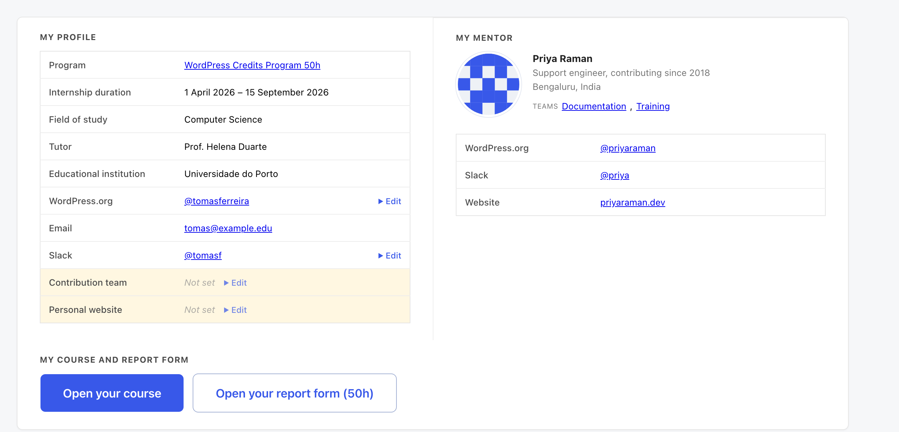
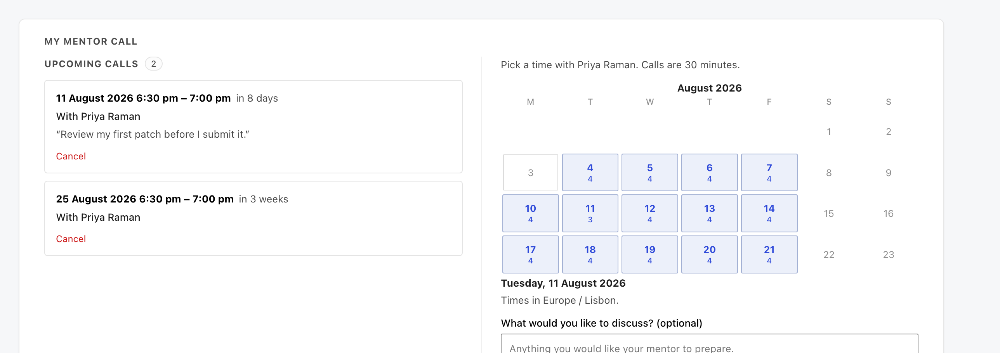

# Student guide

*Everything on your Student Report Card, and how to book a call with your mentor.*

Welcome to the WordPress Education Dashboard. This is where your place on the WordPress Credits Program lives while you are on it: your program details, who your mentor is, and the calendar you book your calls from.

This guide is written for students. Your mentor and the program managers have their own.

## Signing in

Nobody registers on this site, and there is no sign-up form: the program makes every account for
the person it belongs to. That means two things on your first visit:

1. Go to the site's login page and use **Lost your password?** with the email address on your
   account. A reset link arrives at that address.
2. Set a password, and you are in - unless your account also asks for a code, which the next
   part covers.

If the reset email never arrives, the address on your account is probably not the one you are
checking. The login page cannot change it - ask whoever runs the program.

### Signing in with a code

Besides your password, your account may ask for a code. Whether it does is the program's choice,
and it is made for every account of your kind at once. When it does, there is nothing to set up
first: from your next sign-in, the code arrives by email. When it does not, signing in works as
described above, and a card on your page invites you to turn the code on for yourself.

After you enter your username and password, a second screen asks for the code. Which kind depends
on how your account is set up.

**An emailed code.** The screen says a verification code has been sent to the email address on your
account. The email comes from this site and has *Login confirmation code* in its subject line. It
holds a code of eight digits. Type it into **Verification Code** and press **Verify**. A code works
once, and for fifteen minutes. **Resend Code** sends a new one and the new one replaces the old, so
use the newest email.

**An authenticator app.** If you have set one up, the screen asks for the code from your app
instead: **Authentication Code**. Open the app, find this site in it, and type the six digits it
shows. The digits change every 30 seconds, so type the ones on the screen at that moment.

A wrong code does not lock you out for good, but the site makes you wait a moment before the next
try, and the wait grows with every wrong code, up to fifteen minutes. Wait it out, then type the
code again, carefully.

### Setting up an authenticator app

An app on your phone is quicker than waiting for an email, and it keeps working when your inbox
does not. The card at the top of your page starts it. Its heading is **Add a second step to your
sign-in** when the code is yours to choose, and **Your account asks for a code when you sign in**
when the program asks for one; its button, **Turn on two-factor authentication** or **Set up an
authenticator app**, opens your profile screen at its **Two-Factor Options**. Ignoring the card
costs nothing: signing in keeps working the way it does now.

If you already use emailed codes and you open that screen more than about ten minutes after you
signed in, it first asks you to confirm with **Revalidate now**, which takes one more code. Then
follow the steps on the screen: install an authenticator app on your phone (any will do, such as
Google Authenticator or Microsoft Authenticator), scan the QR code the screen shows with it, and
type in the code your app then displays. Once the app is set up the card stops appearing.

Before you leave that screen, generate the **recovery codes** (the card calls them backup codes)
and keep them somewhere other than your phone. Each works once, and the screen shows them only
once. They are how you get back in if you lose the phone.

### If you cannot get your code

- **The email does not come.** Look in your spam folder, then press **Resend Code**. The email goes
  to the address on your account, so if you no longer read that mailbox, an emailed code cannot
  reach you.
- **Your phone or your app is gone.** Under **Having Problems?** on the same screen, the site
  lists any other way your account has, for example **Send a code to your email**, or **Use a
  recovery code** if you saved some. Type one of your saved recovery codes where the screen asks
  for it, and cross that code off, because it will not work twice.
- **You have neither.** Without the emailed code, the app or a recovery code, the site cannot tell
  that it is you, and it lets nobody past that screen. Tell whoever runs the program that you are
  locked out, and give them the username you sign in with. This guide cannot fix it for you.

### Once you are signed in

Your page is drawn for whoever is signed in, so the same address shows each person their own
page, and no change to a link shows anybody else's. The
program's Administrators are the one exception: to help, they can open anyone's page, through a
switcher only they are shown. A company's people share one Sponsor Dashboard: everyone the program
attached to the company sees the same page.

## What is on your Student Report Card

*Your details on the left, your mentor on the right, and the two buttons you came for underneath. Names shown are examples.*

A card at the top of the page may invite you to set up a code for signing in, or tell you the
program asks for one: *Signing in*, at the start of this guide, covers it.

### Arranging your Student Report Card

Below your profile and your mentor, the page is a stack of blocks: the program updates with the
resources, your course, your report form with the feedback forms, your mentor call, and the tools
our sponsors offer. Each block has two small arrows at its top right. Press one and the block moves
up or down at once, and the page remembers your order the next time you open it. The program updates
come first until you move them.

### My profile

Your program details as the program records hold them: your track, your internship dates, your
educational institution, your tutor and your field of study, followed by your WordPress.org profile,
your Slack name, your contribution teams and your personal website.

Nothing here is typed in on this table. The last four come from your **report form** below - fill
them in there and they appear here as soon as you save. The rest - your dates, your institution,
your tutor - come from the program records and cannot be changed from this site at all. If one of
them is wrong, see *If something looks wrong* below.

### My mentor

Who your mentor is and how to reach them: their WordPress.org profile, their Slack handle, their
website, and the contribution teams they work in. This is the person to ask first about anything
to do with your contributions.

### My course

**Open your course** takes you to your course on Learn WordPress - the syllabus for the track you
are on.

Beside it is **Hours contributed**: the running total of the hours you have put in. It is the one
number you will come back to change most often, so it sits here on its own rather than inside the
report form. Type the new total, press **Save hours**, and that is the whole errand.

If your track has no Learn course, or you are not on a track at the moment (paused, for example),
there is no course to open, and the hours box is a section of its own, **My hours**.

### When your graduation is pending

Once you have finished the work and your graduation has not been recorded yet, the program records
hold your status as **Pending graduation**. It is a waiting state, not an ending. You are still on
the program and still your mentor's student.

The status shows on the **Program** row of *My profile*: the row still names the course you took,
linked to Learn WordPress as before, with a **Pending graduation** badge beside it. Everything else
stays as it was while you were working through the course: your course and your hours, your report
form with your course's questions and the answers you saved, and the calendar for booking a call.

If this site has no record of the course you took, the Program row says **Pending graduation**
alone, with no link, your hours have a section of their own, *My hours*, and the report form asks
the 150-hour course's questions.

The status is not yours to change, and not your mentor's either. The program's Administrators move
it on by recording your graduation in the program records, and your card catches up at the next
sync. From then on your time on the program counts as finished, and calls can no longer be booked.
If your graduation looks overdue, ask your mentor, or whoever runs the program.

### Report form

Your report, filled in here on the page. It is the record of your work on the program, and it is
what your mentor reads. When a mentor or a program manager opens your card, your report appears as
plain text rows rather than as a form, so nothing there can be edited by mistake.

Open **Your report form** and the questions are grouped in the order you meet them:

- **Onboarding** - your WordPress.org profile and Slack name, the final grade for each course
  module, and your personal website with the reflection post about building it.
- **Project** - your **contribution team**, what you contributed, the meetings and discussions you
  took part in, and the reflection posts for each stage.
- **Wrap-up** - your closing post.

What is asked depends on your track. The 150-hour course asks for the reflection posts and the
module grades; the 50-hour course asks instead for one final project report; the Developer Track
asks the 150-hour questions with seven more of its own; and the Designer Track follows its own
Learn course lesson by lesson - the course grades and your portfolio first, then the eight practical
lessons, each with its own notes and its own screenshots, then your contribution team and project,
then your reflection posts, the alumni program section with the meetings you took part in, the event
you attended and your closing post.

**Screenshots, on the Designer Track.** The practical lessons ask you to show your work, so those
questions take a picture instead of a link: a PNG, JPEG or WebP file of up to 4 MB, and twenty
uploads a day across all of them. The file is kept on this site and a copy is sent to the program
records, which is why the picture on your card is this site's copy and still there tomorrow.
Under each picture, choosing a new file **replaces** what is there, and **Remove** deletes it from
both places at once. Your mentor and the program managers see your screenshots when they open your
Student Report Card, so treat one as part of your report rather than as a private note.

The grades are yours to copy across from wherever you were marked - this form records them, it does
not decide them. Fill in what you have and press **Save my report**; you can come back and add the
rest whenever. Everything goes straight into the program records, so your mentor sees it as soon as
you save, and the four fields that also appear in *My profile* above update there at the same time.

### Feedback forms

Under your report, and nothing to do with it: three short forms asking how the program is going for
you. See *Telling us how it is going* below.

### Tools from our sponsors

The program's sponsors offer their tools to current students: a year of hosting, a premium plugin, a course. When a sponsor switches an offer on, it appears here with the sponsor's logo, what you get and how to redeem it. Press *Get my code*, beside the offer's *More information* link, and your code appears below, under *Your codes*, yours to keep; where the sponsor gives one link for everyone, *Show me the code* puts it there. Once you have claimed an offer, its card shows only the offer and the day you claimed it. Everything you have claimed stays under *Your codes*, even after an offer ends.

Only you see your codes. Nobody is sent a code by mail, and sponsors see how many people claimed, never who. If a code does not work, press *Report a problem with this code* beside it: your program contact is told the offer and the last four characters and gets back to you. A program manager looking at your card sees only how many tools you claimed.

### Resources

At the foot of the page: the students Slack channel, the Student guide in the handbook, and **Need
help?** - a question box answered from the WordPress documentation, if the program has switched it
on. Beside them, **Program updates and announcements** lists anything recently posted for you.

## Booking a call with your mentor

Your mentor publishes the hours they are free, and you pick from them. There is no email back and
forth about what suits.

*Days with times available are highlighted. Pick a day, then a time.*

Days with something open carry a count. Press one and the times for that day appear underneath.
Booking is a single press, with an optional note about what you would like to discuss - worth
writing, because it is what lets your mentor prepare.

Both of you get an email with a calendar invitation attached, so the call lands in your calendar
rather than only on this page. A reminder goes out 24 hours before.

If something comes up you can cancel from the same section, and the slot goes straight back on
your mentor's calendar for somebody else.

A few things worth knowing:

- Slots closer than your mentor's shortest notice are not offered at all.
- Your mentor sets how far ahead you can book, so the calendar stops at some point in the future.
- There may be a limit on how many calls you can hold at once. Cancel one you no longer need and
  the next becomes bookable.
- Times are shown in your own timezone, and in your mentor's on their side. Neither of you has to
  do the arithmetic.

**If your mentor has published nothing yet**, the section says so. That is not a fault on your
side - ask them in Slack to set their hours.

## Group sessions

Your mentor may run a session for several students at once - a walkthrough, a question hour,
something for everybody who started the same week. Those appear under *My mentor call* in a list of
their own, *Group sessions with your mentor*, apart from the calls you book, with what the session
is about and how many places are left.

**Join this session** puts you on it, and you get an email with a calendar invitation the same as a
private call. If something changes, **Leave the session** asks first, then takes you off and frees
your place for somebody else. Once a session has started, its row says so instead of offering either
button, and its time reads how long ago it began; the row stays on your list for an hour so you can
still find the link.

A session does not count towards the number of upcoming calls you may hold at once: join every
session that has a place, and your one-to-one booking is unaffected.

Your mentor may plan a **series**: several sessions on several dates, with the same topic, length
and places. The list shows a series under one heading, each date as its own row. **Join all** puts
you on every date that still has a place and sends you one email with one calendar file that plans
them all; a date that is already full is skipped, and the message says so. You can still join or
leave a single date from its row.

If your mentor changes, a session of your former mentor's that you are on stays on your list, with
their name and **Leave the session**, and the list is headed simply *Group sessions*. Once the
program records show the change for you and for both mentors, you are taken off it and sent an email
whose calendar file takes it out of your calendar.

## Telling us how it is going

Under your report form are three short forms - **Getting started**, **Half way** and **Finishing
up** - one for each stage of the program. Each takes a couple of minutes.

**They open one at a time.** *Half way* appears once you have answered everything in *Getting
started*, and *Finishing up* once you have finished both. That is not a hoop to jump through: the
three forms ask the same three questions at three different points, and the answers are only worth
anything if they are given months apart rather than all on your last day.

They are feedback about the program, not part of your report. They are not marked, your institution
does not see them apart from the one exception below, and leaving them alone has no effect on your
place on the program or on your credits. That is the whole reason they are separate: they are only
useful if you say what you actually think.

**The exception is yours to grant, and nobody can grant it for you.** At the end of a term the
program drafts a semester report about the students your institution sent - how many took part,
which teams they contributed to, and what they published. A program manager reviews and approves
it, and only then can your institution read it. Two questions on the *Finishing up* form, and
only those two, decide what of yours goes into it - whether your institution may list you (by name,
or by your blog address alone), and whether it may quote your feedback (with your name, or without
it). Nothing else you write in these forms is shown to your institution, and a quote you have not
released is not shown to them either: not as a draft, and not to ask. Answer *No*, or leave both
alone, and the report is built without you.

You can change your mind at any time. Reopen *Finishing up*, change the answer, and you drop out of
your institution's report the next time anyone opens it - including a report that was written weeks
ago and has already been printed once.

### What they ask

Three questions repeat word for word in all three forms - your overall experience, how confident you
feel contributing, and how much your mentor's support is helping. Answering the same three at each
stage is what lets the program see how the experience changes over time rather than only how it
ended.

The rest are about the stage you are at: how easy it was to get started, whether you feel part of the
WordPress community, whether the hours feel achievable, what you would change. A few questions only
appear when they apply - say the hours are hard to reach and a box opens asking why.

**Finishing up** ends with four optional permissions, in a box of their own: whether a quote about
your experience may be shared publicly, whether the program may contact you about WordPress events
and opportunities, and the two questions above about your institution's semester report. All four
are yours to decline, and declining changes nothing else. Only you can answer them - a program
manager looking at your form sees them and cannot fill them in for you.

### Filling one in

Open the form for the stage you are at, answer what you want to answer, and press **Save my
answers**. Nothing is required - a form with two answers in it is worth more than one nobody filled
in.

You can change any answer later: open the form again and your answers are still there. The form's
title tells you how many of its questions you have answered, and says *all answered* when you have
finished it - which is also when the next one appears.

The count only ever includes the questions you are actually being asked. A follow-up that did not
apply to you is not a question you have left blank.

Your mentor does not see these answers on their page.

### Leaving the program

If you finish early or do not complete the program, the three forms above are replaced by a single
short one, **Leaving the program** - four questions about how far you got and what stopped you. It
is the part of the program we hear about least, and the part most worth hearing about.

## If something looks wrong

Your program details come from the program records, so if your dates, institution or tutor are not
right, that is where it has to be corrected - changing it here would be overwritten at the next
sync. Ask your mentor, or whoever runs the program.

Your WordPress.org profile, Slack name, contribution team and personal website are the exceptions.
Those four are asked for on your **report form**, and saving it writes them back to the records - so
they are yours to keep current, and the way to correct them is to correct them there.

If the page shows nothing at all, or says it cannot find your record, your account exists but is
not linked to a program record yet. That is one for the program managers.
